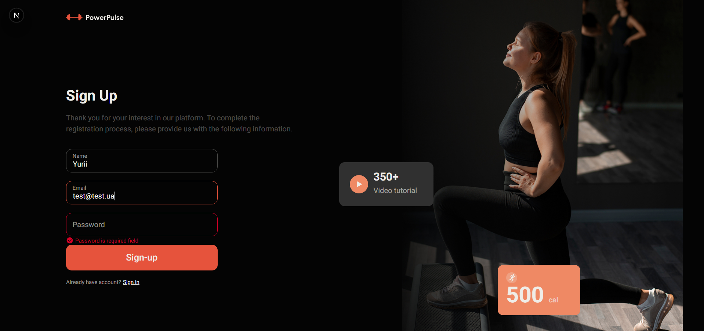
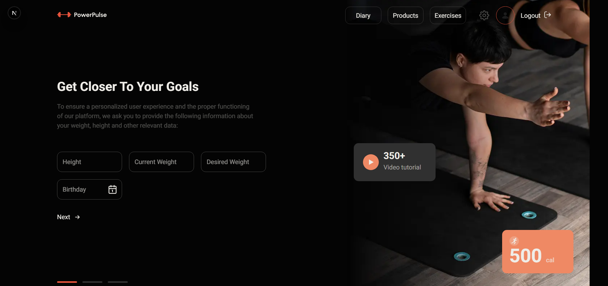
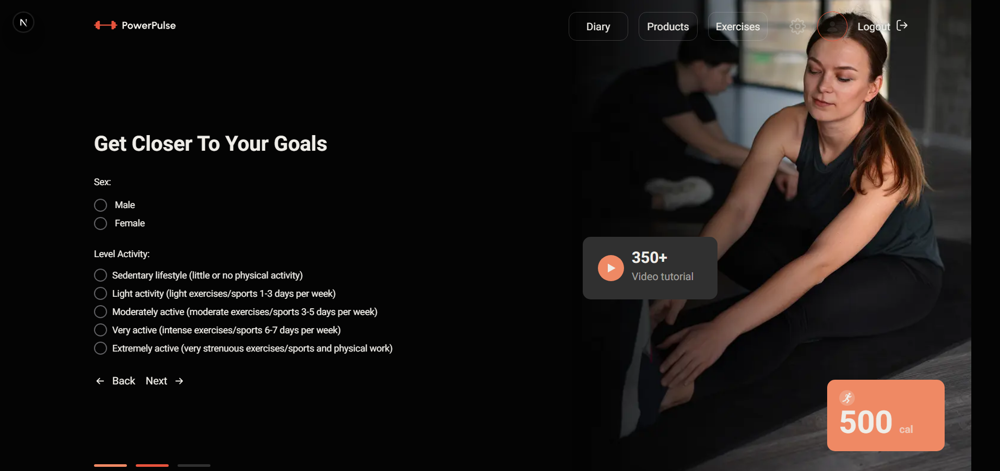
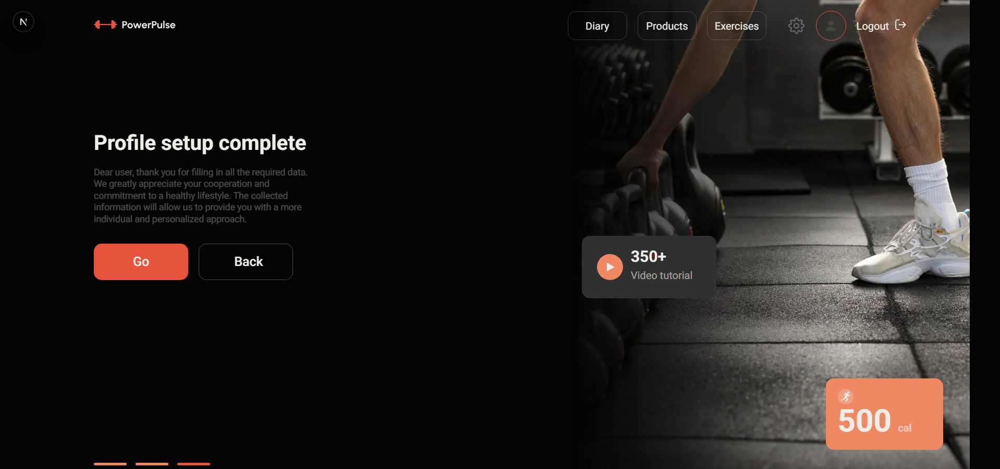
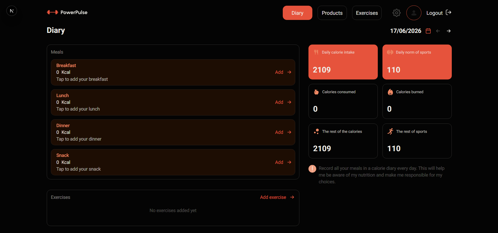
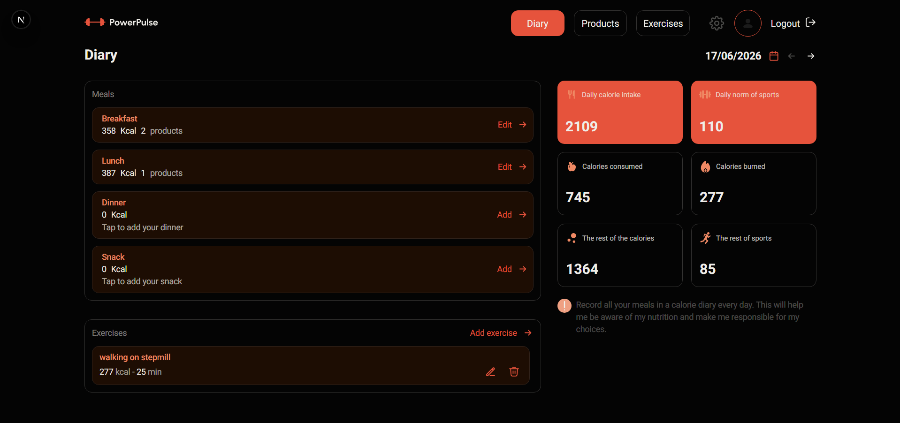

# Power Pulse

Power Pulse is a full-stack fitness tracking application that helps users set up a personal fitness profile, calculate daily nutrition goals, and track meals and workouts in a daily diary.

The project focuses on a complete user flow: registration, profile setup, personalized calorie calculation, protected dashboard access, and daily progress tracking. It combines a responsive UI with server-side validation, MongoDB persistence, and cookie-based authentication.

## Live Demo

[Open Power Pulse](https://power-pulse-beta.vercel.app/)

## Highlights

- Full authentication flow with registration, login, logout, protected routes, and refresh-token sessions.
- Three-step profile setup for collecting user metrics and calculating a personal daily calorie norm.
- Daily diary for tracking consumed products and completed exercises.
- Empty and filled diary states, so the interface works for both new and active users.
- Product and exercise catalogs that can be filtered and searched before adding items to the diary.
- Responsive layout with dedicated desktop, tablet, and mobile visuals.
- Server-side validation for auth, profile data, diary dates, products, and exercises.
- MongoDB models for users, sessions, products, exercises, filters, and diary entries.

## Screenshots

### Landing and Authentication

<p>
  
  
</p>

### Profile Setup

<p>
  
  
  
</p>

### Diary

<p>
  
  
</p>

## Tech Stack

- Next.js 16 with App Router
- React 19
- TypeScript
- Tailwind CSS 4
- MongoDB with Mongoose
- JWT access tokens and refresh-token sessions stored in `httpOnly` cookies
- Zod/Yup validation
- Zustand for client-side auth state
- Axios for client API calls

## Core Flow

1. A user lands on the public home page and creates an account.
2. After registration, the user completes a three-step profile setup.
3. The app calculates a daily calorie norm based on profile data.
4. The user can browse products and exercises, then add selected items to the diary.
5. The diary summarizes consumed calories, burned calories, and remaining daily balance.

## Getting Started

Requirements:

- Node.js 20+
- npm
- MongoDB database

Create a `.env` file in the project root:

```env
MONGODB_URL=your_mongodb_connection_string
JWT_SECRET=your_jwt_secret
```

Install dependencies:

```bash
npm install
```

Run the development server:

```bash
npm run dev
```

Open:

```text
http://localhost:3000
```

Other commands:

```bash
npm run build
npm run start
npm run lint
```

## Project Structure

```text
app/                 Next.js App Router pages, layouts, and API routes
components/          Shared UI and feature components
components/icons/    Local icon components
components/ui/       Smaller reusable UI widgets
lib/client/          Client API wrappers and client-side store
lib/server/          Database, auth, API helpers, and server data access
lib/shared/          Types, constants, validators, mappers, and utilities
models/              Mongoose models
providers/           React providers
public/              Static assets and screenshots
```

## Database Notes

The app expects MongoDB collections for user-owned data and catalog data.

Application-owned collections:

- `users`
- `sessions`
- `diaries`

Catalog collections used by product and exercise pages:

- `products`
- `productsCategories`
- `exercises`
- `filters`

Product and exercise catalog data should already exist in MongoDB. This repository does not include a seed script, so a fresh empty database will not show catalog content until those collections are populated.

## Route Overview

Public routes:

- `/`
- `/auth/login`
- `/auth/register`

Protected routes:

- `/diary`
- `/diary/[date]`
- `/diary/[date]/meals/[mealType]`
- `/profile`
- `/profile/edit`
- `/products`
- `/exercises`
- `/exercises/[filter]`
- `/exercises/[filter]/[category]`

API routes:

- `POST /api/auth/register`
- `POST /api/auth/login`
- `POST /api/auth/logout`
- `POST /api/auth/refresh`
- `GET /api/users/me`
- `PATCH /api/users/profile`
- `GET /api/products`
- `GET /api/exercises`
- `POST /api/diary/[date]/meals/[mealType]/products`
- `PATCH /api/diary/[date]/meals/[mealType]/products/[diaryProductId]`
- `DELETE /api/diary/[date]/meals/[mealType]/products/[diaryProductId]`
- `POST /api/diary/[date]/exercises`
- `PATCH /api/diary/[date]/exercises/[diaryExerciseId]`
- `DELETE /api/diary/[date]/exercises/[diaryExerciseId]`

## Authentication Model

The app uses short-lived JWT access tokens and longer-lived refresh tokens:

- access token lifetime: 15 minutes
- refresh token lifetime: 30 days
- refresh tokens are stored hashed in the `sessions` collection
- protected pages are guarded by `proxy.ts`
- API routes validate cookies server-side and refresh access tokens when possible

Auth cookies are configured as `httpOnly`, `sameSite: "lax"`, and `secure: true`.

## Implementation Details

- Diary product and exercise entries store snapshots of the source data, so historical diary records stay stable if catalog data changes later.
- Exercise calories are calculated from MET and user weight when available.
- Search input is escaped before building MongoDB regex filters.
- Diary dates are validated against the user's allowed date range.
- Remote exercise images from `ftp.goit.study/img/**` are allowed in `next.config.ts`.

## Notes

- Automated tests are not configured yet.
